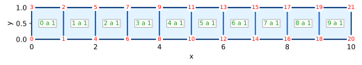
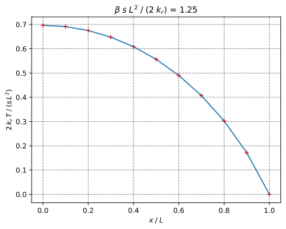
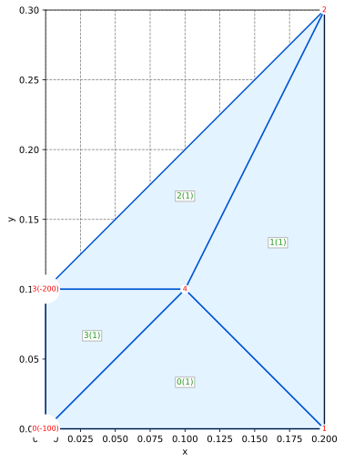

# Porous Media Simulator using the Finite Element Method

🚧 Work in progress...

This code implements simulator using the finite element method for the behavior of solids, structures, and porous media.

Documentation:

- [API reference (docs.rs)](https://docs.rs/pmsim)

## Installation

We use [the Russell platform](https://github.com/cpmech/russell) and, thus, we need to install some Debian packages.

Install some libraries:

```bash
sudo apt-get install \
    liblapacke-dev \
    libopenblas-dev
```

Add this to your Cargo.toml:

```toml
[dependencies]
pmsim = "0.2"
```

## Examples

For all simulations:

```text
Legend:
✅ : converged
👍 : converging
🥵 : diverging
😱 : found NaN or Inf
❋  : non-scaled max(R)
?  : no info abut convergence
```

### Heat: Arpaci Nonlinear 1d

Arpaci's Example 3-8 on page 130 (variable conductivity)

* Arpaci V. S. (1966) Conduction Heat Transfer, Addison-Wesley, 551p

#### Test goal

This tests verifies the nonlinear solver for the diffusion equation
with a variable conductivity coefficient.

#### Mesh



#### Initial conditions

Temperature T = 0 at all points

#### Boundary conditions

Temperature T = 0 on right side @ x = L

#### Configuration and parameters

* Steady simulation
* Source = 5
* Variable conductivity (k = (1 + β T) kᵣ I) with kᵣ = 2

#### Note

The temperature at the right T = 0 (T_inf) must be zero in order to
result in k(T_inf) = kᵣ as required by the analytical solution.

#### Simulation and results

[heat_arpaci_nonlinear_1d.rs](examples/heat_arpaci_nonlinear_1d.rs)

```text
                                                  _   
timestep             t            Δt  iter    max(R)  
       1   1.000000e-1   1.000000e-1     .        .  
       .             .             .     1    2.50e0❋ 
       .             .             .     2    1.28e0? 
       .             .             .     3   9.36e-2👍
       .             .             .     4   1.25e-3👍
       .             .             .     5   1.42e-7👍
       .             .             .     6  1.35e-14✅

T(0) = 87.08286933869708  (87.08286933869707)
```



### Heat: Bhatti 1d5 Convection

Bhatti's Example 1.5 on page 28

* Bhatti, M.A. (2005) Fundamental Finite Element Analysis and Applications, Wiley, 700p.

#### Test goal

This test verifies the steady heat equation with prescribed temperature and convection

#### Mesh



#### Boundary conditions

* Convection Cc = (27, 20) on the right edge
* Prescribed temperature T = 300 on the left edge

#### Configuration and parameters

* Steady simulation
* No source
* Constant conductivity kx = ky = 1.4

#### Simulation and results

[heat_bhatti_1d5_convection](examples/heat_bhatti_1d5_convection.rs)

```text
timestep             t            Δt  iter    max(R)  
       1   1.000000e-1   1.000000e-1     .        .  
       .             .             .     1    1.05e3❋ 
       .             .             .     2  1.71e-15✅
```

### Heat: Bhatti 6d22 Convection

### Heat: Lewis Transient 1d

### Heat: Mathematica Axisymmetric Nafems

### Heat: Mathematica Axisymmetric Simple

### Rod: Bhatti 1d4 Truss

### Solid Bhatti 1d6 Plane Stress

### Solid Felippa Thick Cylinder Axisymmetric

### Solid Smith 5d11 Qua4 Plane Strain_uy

### Solid Smith 5d15 Qua8 Plane Strain

### Solid Smith 5d17 Qua4 Axisymmetric

### Solid Smith 5d24 Hex20 3D

### Solid Smith 5d27 Qua9 Plane Strain

### Solid Smith 5d2 Tri3 Plane Strain

### Solid Smith 5d30 Tet4 3D

### Solid Smith 5d7 Tri15 Plane Strain
