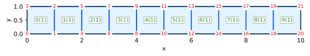

# Porous Media Simulator using the Finite Element Method

🚧 Work in progress...

This code implements simulator using the finite element method for the behavior of solids, structures, and porous media.

Documentation:

- [API reference (docs.rs)](https://docs.rs/pmsim)

## Installation

We use [the Russell platform](https://github.com/cpmech/russell) and, thus, we need to install some Debian packages.

Install some libraries:

```bash
sudo apt-get install \
    liblapacke-dev \
    libopenblas-dev
```

Add this to your Cargo.toml:

```toml
[dependencies]
pmsim = "0.2"
```

## Examples

For all simulations:

```text
Legend:
✅ : converged
👍 : converging
🥵 : diverging
😱 : found NaN or Inf
❋  : non-scaled max(R)
?  : no info abut convergence
```

### Heat: Arpaci Nonlinear 1d

Arpaci's Example 3-8 on page 130 (variable conductivity)

* Arpaci V. S. (1966) Conduction Heat Transfer, Addison-Wesley, 551p

#### Test goal

This tests verifies the nonlinear solver for the diffusion equation
with a variable conductivity coefficient.

#### Mesh



#### Initial conditions

Temperature T = 0 at all points

#### Boundary conditions

Temperature T = 0 on right side @ x = L

#### Configuration and parameters

* Steady simulation
* Source = 5
* Variable conductivity (k = (1 + β T) kᵣ I) with kᵣ = 2

#### Note

The temperature at the right T = 0 (T_inf) must be zero in order to
result in k(T_inf) = kᵣ as required by the analytical solution.

#### Simulation and results

[heat_arpaci_nonlinear_1d.rs](examples/heat_arpaci_nonlinear_1d.rs)

```text
                                                  _   
timestep             t            Δt  iter    max(R)  
       1   1.000000e-1   1.000000e-1     .        .  
       .             .             .     1    2.50e0❋ 
       .             .             .     2    1.28e0? 
       .             .             .     3   9.36e-2👍
       .             .             .     4   1.25e-3👍
       .             .             .     5   1.42e-7👍
       .             .             .     6  1.35e-14✅

T(0) = 87.08286933869708  (87.08286933869707)
```


### Heat: Bhatti Example 1.5 Convection

Bhatti's Example 1.5 on page 28

* Bhatti, M.A. (2005) Fundamental Finite Element Analysis and Applications, Wiley, 700p.

#### Test goal

This test verifies the steady heat equation with prescribed temperature and convection

#### Mesh


#### Boundary conditions

* Convection Cc = (27, 20) on the right edge
* Prescribed temperature T = 300 on the left edge

#### Configuration and parameters

* Steady simulation
* No source
* Constant conductivity kx = ky = 1.4

#### Simulation and results

[heat_bhatti_1d5_convection.rs](examples/heat_bhatti_1d5_convection.rs)

```text
                                                  _   
timestep             t            Δt  iter    max(R)  
       1   1.000000e-1   1.000000e-1     .        .  
       .             .             .     1    1.05e3❋ 
       .             .             .     2  1.71e-15✅
```

### Heat: Bhatti Example 6.22 Convection

Bhatti's Example 6.22 on page 449

* Bhatti, M.A. (2005) Fundamental Finite Element Analysis and Applications, Wiley, 700p.

#### Test goal

This test verifies the steady heat equation with prescribed temperature, convection,
flux, and a volumetric source term. Also, it checks the use of Qua8 elements.

#### Mesh


#### Boundary conditions (see page 445)

* Flux Qt = 8,000 on left side, edge (0,10,11)
* Convection Cc = (55, 20) on top edges (0,2,1), (2,4,3), and (4,6,5)
* Prescribed temperature T = 110 on the bottom edge (8,10,9)

#### Configuration and parameters

* Steady simulation
* Source = 5e6 over the region
* Constant conductivity kx = ky = 45

#### Simulation and results

[heat_bhatti_6d22_convection](examples/heat_bhatti_6d22_convection.rs)

```text
                                                  _   
timestep             t            Δt  iter    max(R)  
       1   1.000000e-1   1.000000e-1     .        .  
       .             .             .     1    3.09e4❋ 
       .             .             .     2  6.09e-16✅
```

### Heat: Lewis Example 6.4.2 Transient 1d

Lewis' Example 6.4.2 on page 159

* Lewis R, Nithiarasu P, and Seetharamu KN (2004) Fundamentals of the
Finite Element Method for Heat and Fluid Flow, Wiley, 341p

#### Test goal

This test verifies the transient diffusion in 1D

#### Mesh

```text
o-----------------------------------------------------------o
|    |    |    |    |    |    |    |    |    |    .....     | h = 1
o-----------------------------------------------------------o
                     <-  L = 20 ->
```


#### Initial conditions

Temperature T = 0 at all points

#### Boundary conditions

Flux Qt = 1 on left side @ x = 0

#### Configuration and parameters

* Transient simulation
* No source
* Constant conductivity kx = ky = 1
* Coefficient ρ = 1

#### Simulation and results

[heat_lewis_transient_1d.rs](examples/heat_lewis_transient_1d.rs)

```text
                                                  _   
timestep             t            Δt  iter    max(R)  
       1   1.000000e-1   1.000000e-1     .        .  
       .             .             .     1   6.67e-1❋ 
       .             .             .     2  2.36e-16✅
       2   2.000000e-1   1.000000e-1     .        .  
       .             .             .     1    1.24e0❋ 
       .             .             .     2  6.07e-16✅
       3   3.000000e-1   1.000000e-1     .        .  
       .             .             .     1    1.08e0❋ 
       .             .             .     2  2.55e-16✅
       4   4.000000e-1   1.000000e-1     .        .  
       .             .             .     1   9.73e-1❋ 
       .             .             .     2  3.38e-16✅
       5   5.000000e-1   1.000000e-1     .        .  
       .             .             .     1   8.94e-1❋ 
       .             .             .     2  3.25e-16✅
       6   6.000000e-1   1.000000e-1     .        .  
       .             .             .     1   8.33e-1❋ 
       .             .             .     2  4.24e-16✅
       7   7.000000e-1   1.000000e-1     .        .  
       .             .             .     1   7.84e-1❋ 
       .             .             .     2  6.89e-16✅
       8   8.000000e-1   1.000000e-1     .        .  
       .             .             .     1   7.44e-1❋ 
       .             .             .     2  4.46e-16✅
       9   9.000000e-1   1.000000e-1     .        .  
       .             .             .     1   7.09e-1❋ 
       .             .             .     2  5.85e-16✅
      10    1.000000e0   1.000000e-1     .        .  
       .             .             .     1   6.79e-1❋ 
       .             .             .     2  1.03e-15✅

point = 0, x = 0.00, T = 1.105099, diff = 2.3280e-2
point = 3, x = 0.00, T = 1.105099, diff = 2.3280e-2
point = 7, x = 0.00, T = 1.105099, diff = 2.3280e-2
point = 4, x = 1.00, T = 0.376835, diff = 2.2447e-2
point = 6, x = 1.00, T = 0.376835, diff = 2.2447e-2
point = 1, x = 2.00, T = 0.085042, diff = 1.5467e-2
point = 2, x = 2.00, T = 0.085042, diff = 1.5467e-2
```

### Heat: Mathematica Axisymmetric Nafems

### Heat: Mathematica Axisymmetric Simple

### Rod: Bhatti 1d4 Truss

### Solid Bhatti 1d6 Plane Stress

### Solid Felippa Thick Cylinder Axisymmetric

### Solid Smith 5d11 Qua4 Plane Strain_uy

### Solid Smith 5d15 Qua8 Plane Strain

### Solid Smith 5d17 Qua4 Axisymmetric

### Solid Smith 5d24 Hex20 3D

### Solid Smith 5d27 Qua9 Plane Strain

### Solid Smith 5d2 Tri3 Plane Strain

### Solid Smith 5d30 Tet4 3D

### Solid Smith 5d7 Tri15 Plane Strain
