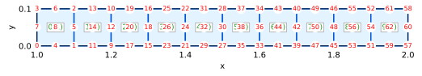
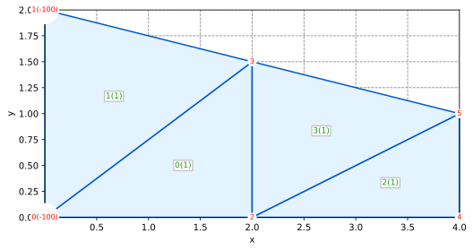
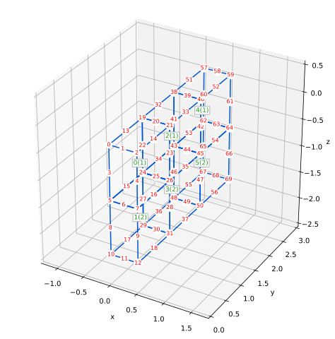
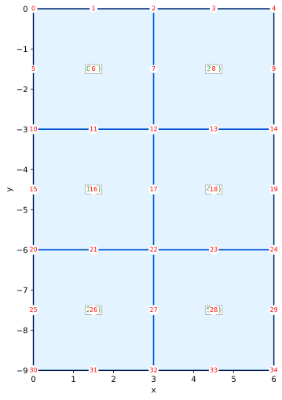

# Porous Media Simulator using the Finite Element Method

🚧 Work in progress...

This code implements simulator using the finite element method for the behavior of solids, structures, and porous media.

Documentation:

- [API reference (docs.rs)](https://docs.rs/pmsim)

## Installation

We use [the Russell platform](https://github.com/cpmech/russell) and, thus, we need to install some Debian packages.

Install some libraries:

```bash
sudo apt-get install \
    liblapacke-dev \
    libopenblas-dev
```

Add this to your Cargo.toml:

```toml
[dependencies]
pmsim = "0.2"
```

## Examples

For all simulations:

```text
Legend:
✅ : converged
👍 : converging
🥵 : diverging
😱 : found NaN or Inf
❋  : non-scaled max(R)
?  : no info abut convergence
```

### Heat: Arpaci Nonlinear 1d

Arpaci's Example 3-8 on page 130 (variable conductivity)

* Arpaci V. S. (1966) Conduction Heat Transfer, Addison-Wesley, 551p

#### Test goal

This tests verifies the nonlinear solver for the diffusion equation
with a variable conductivity coefficient.

#### Mesh


#### Initial conditions

Temperature T = 0 at all points

#### Boundary conditions

Temperature T = 0 on right side @ x = L

#### Configuration and parameters

* Steady simulation
* Source = 5
* Variable conductivity (k = (1 + β T) kᵣ I) with kᵣ = 2

#### Note

The temperature at the right T = 0 (T_inf) must be zero in order to
result in k(T_inf) = kᵣ as required by the analytical solution.

#### Simulation and results

[heat_arpaci_nonlinear_1d.rs](examples/heat_arpaci_nonlinear_1d.rs)

```text
                                                  _   
timestep             t            Δt  iter    max(R)  
       1   1.000000e-1   1.000000e-1     .        .  
       .             .             .     1    2.50e0❋ 
       .             .             .     2    1.28e0? 
       .             .             .     3   9.36e-2👍
       .             .             .     4   1.25e-3👍
       .             .             .     5   1.42e-7👍
       .             .             .     6  1.35e-14✅

T(0) = 87.08286933869708  (87.08286933869707)
```

The figure below compares the numerical with the analytical results.


### Heat: Bhatti Example 1.5 Convection

Bhatti's Example 1.5 on page 28

* Bhatti, M.A. (2005) Fundamental Finite Element Analysis and Applications, Wiley, 700p.

#### Test goal

This test verifies the steady heat equation with prescribed temperature and convection

#### Mesh


#### Boundary conditions

* Convection Cc = (27, 20) on the right edge
* Prescribed temperature T = 300 on the left edge

#### Configuration and parameters

* Steady simulation
* No source
* Constant conductivity kx = ky = 1.4

#### Simulation and results

[heat_bhatti_1d5_convection.rs](examples/heat_bhatti_1d5_convection.rs)

```text
                                                  _   
timestep             t            Δt  iter    max(R)  
       1   1.000000e-1   1.000000e-1     .        .  
       .             .             .     1    1.05e3❋ 
       .             .             .     2  1.71e-15✅
```

### Heat: Bhatti Example 6.22 Convection

Bhatti's Example 6.22 on page 449

* Bhatti, M.A. (2005) Fundamental Finite Element Analysis and Applications, Wiley, 700p.

#### Test goal

This test verifies the steady heat equation with prescribed temperature, convection,
flux, and a volumetric source term. Also, it checks the use of Qua8 elements.

#### Mesh


#### Boundary conditions (see page 445)

* Flux Qt = 8,000 on left side, edge (0,10,11)
* Convection Cc = (55, 20) on top edges (0,2,1), (2,4,3), and (4,6,5)
* Prescribed temperature T = 110 on the bottom edge (8,10,9)

#### Configuration and parameters

* Steady simulation
* Source = 5e6 over the region
* Constant conductivity kx = ky = 45

#### Simulation and results

[heat_bhatti_6d22_convection.rs](examples/heat_bhatti_6d22_convection.rs)

```text
                                                  _   
timestep             t            Δt  iter    max(R)  
       1   1.000000e-1   1.000000e-1     .        .  
       .             .             .     1    3.09e4❋ 
       .             .             .     2  6.09e-16✅
```

### Heat: Lewis Example 6.4.2 Transient 1d

Lewis' Example 6.4.2 on page 159

* Lewis R, Nithiarasu P, and Seetharamu KN (2004) Fundamentals of the
Finite Element Method for Heat and Fluid Flow, Wiley, 341p

#### Test goal

This test verifies the transient diffusion in 1D

#### Mesh

```text
o-----------------------------------------------------------o
|    |    |    |    |    |    |    |    |    |    .....     | h = 1
o-----------------------------------------------------------o
                     <-  L = 20 ->
```


#### Initial conditions

Temperature T = 0 at all points

#### Boundary conditions

Flux Qt = 1 on left side @ x = 0

#### Configuration and parameters

* Transient simulation
* No source
* Constant conductivity kx = ky = 1
* Coefficient ρ = 1

#### Simulation and results

[heat_lewis_transient_1d.rs](examples/heat_lewis_transient_1d.rs)

```text
                                                  _   
timestep             t            Δt  iter    max(R)  
       1   1.000000e-1   1.000000e-1     .        .  
       .             .             .     1   6.67e-1❋ 
       .             .             .     2  2.36e-16✅
       2   2.000000e-1   1.000000e-1     .        .  
       .             .             .     1    1.24e0❋ 
       .             .             .     2  6.07e-16✅
       3   3.000000e-1   1.000000e-1     .        .  
       .             .             .     1    1.08e0❋ 
       .             .             .     2  2.55e-16✅
       4   4.000000e-1   1.000000e-1     .        .  
       .             .             .     1   9.73e-1❋ 
       .             .             .     2  3.38e-16✅
       5   5.000000e-1   1.000000e-1     .        .  
       .             .             .     1   8.94e-1❋ 
       .             .             .     2  3.25e-16✅
       6   6.000000e-1   1.000000e-1     .        .  
       .             .             .     1   8.33e-1❋ 
       .             .             .     2  4.24e-16✅
       7   7.000000e-1   1.000000e-1     .        .  
       .             .             .     1   7.84e-1❋ 
       .             .             .     2  6.89e-16✅
       8   8.000000e-1   1.000000e-1     .        .  
       .             .             .     1   7.44e-1❋ 
       .             .             .     2  4.46e-16✅
       9   9.000000e-1   1.000000e-1     .        .  
       .             .             .     1   7.09e-1❋ 
       .             .             .     2  5.85e-16✅
      10    1.000000e0   1.000000e-1     .        .  
       .             .             .     1   6.79e-1❋ 
       .             .             .     2  1.03e-15✅

point = 0, x = 0.00, T = 1.105099, diff = 2.3280e-2
point = 3, x = 0.00, T = 1.105099, diff = 2.3280e-2
point = 7, x = 0.00, T = 1.105099, diff = 2.3280e-2
point = 4, x = 1.00, T = 0.376835, diff = 2.2447e-2
point = 6, x = 1.00, T = 0.376835, diff = 2.2447e-2
point = 1, x = 2.00, T = 0.085042, diff = 1.5467e-2
point = 2, x = 2.00, T = 0.085042, diff = 1.5467e-2
```

### Heat: Mathematica Axisymmetric Nafems

From Mathematica Heat Transfer Model Verification Tests
(HeatTransfer-FEM-Stationary-2DAxisym-Single-HeatTransfer-0002)

NAFEMS benchmark test

* https://reference.wolfram.com/language/PDEModels/tutorial/HeatTransfer/HeatTransferVerificationTests.html

#### Test goal

This test verifies the steady heat equation with a localized flux boundary condition

```text
MESH (not-to-scale, not-equal-axis)

0.14     ||++++++++++++++++++++++++
         ||   |    |    |    |    +
         ||-----------------------+
         ||   |    |    |    |    +
0.10  →→ |------------------------+  yb
      →→ |    |    |    |    |    +
      →→ |------------------------+
      →→ |    |    |    |    |    +
      →→ |------------------------+
      →→ |    |    |    |    |    +
0.04  →→ |--------(#)-------------+  ya
         ||   |    |    |    |    +
         ||-----------------------+
         ||   |    |    |    |    +
0.00     ||++++++++++++++++++++++++
        0.02     0.04            0.10
        rin      rref            rout

'+' indicates sides with T = 273.15
|| means insulated
→→ means flux with Qt = 5e5
(#) indicates a reference point to check the results
```


#### Initial conditions

Temperature T = 0 at all points

#### Boundary conditions

* Temperature T = 273.15 on the top, bottom, and right edges
* Flux Qt = 5e5 on the middle-left edges from y=0.04 to y=0.10

#### Configuration and parameters

* Steady simulation
* No source
* Constant conductivity kx = ky = 52

#### Simulation and results

[heat_mathematica_axisym_nafems.rs](examples/heat_mathematica_axisym_nafems.rs)

```text
                                                  _   
timestep             t            Δt  iter    max(R)  
       1   1.000000e-1   1.000000e-1     .        .  
       .             .             .     1    4.45e3❋ 
       .             .             .     2  3.23e-12✅

T = 332.9704335048643, reference = 332.97, rel_error = 0.00013019 %
```

### Heat: Mathematica Axisymmetric Simple

From Mathematica Heat Transfer Model Verification Tests
(HeatTransfer-FEM-Stationary-2DAxisym-Single-HeatTransfer-0001)

2D Axisymmetric Single Equation

* https://reference.wolfram.com/language/PDEModels/tutorial/HeatTransfer/HeatTransferVerificationTests.html

#### Test goal

This test verifies the steady heat equation in 1D with prescribed flux

#### Mesh

```text
  →→ ---------------------
  →→ |    |    |    |    |  h
  →→ ---------------------
    1.0                 2.0
    rin                rout
```



#### Initial conditions

Temperature T = 0 at all points

#### Boundary conditions

* Temperature T = 10.0 on the right edge
* Flux Qt = 100.0 on the left edge

#### Configuration and parameters

* Steady simulation
* No source
* Constant conductivity kx = ky = 10.0

#### Simulation and results

[heat_mathematica_axisym_simple.rs](examples/heat_mathematica_axisym_simple.rs)

```text
                                                  _   
timestep             t            Δt  iter    max(R)  
       1   1.000000e-1   1.000000e-1     .        .  
       .             .             .     1    3.51e2❋ 
       .             .             .     2  3.55e-13✅
```

### Rod: Bhatti Example 1.4 Truss

Bhatti's Example 1.4 on page 25

* Bhatti, M.A. (2005) Fundamental Finite Element Analysis and Applications, Wiley, 700p.

#### Test goal

This test verifies a 2D frame with rod elements and concentrated forces

#### Mesh


#### Boundary conditions

* Fully fixed @ points 0 and 3
* Concentrated load @ point 1 with Fy = -150,000

#### Configuration and parameters

* Static simulation
* Attribute 1: Area = 4,000; Young = 200,000
* Attribute 2: Area = 3,000; Young = 200,000
* Attribute 3: Area = 2,000; Young =  70,000

#### Simulation and results

[rod_bhatti_1d4_truss.rs](examples/rod_bhatti_1d4_truss.rs)

```text
                                                  _   
timestep             t            Δt  iter    max(R)  
       1   1.000000e-1   1.000000e-1     .        .  
       .             .             .     1    1.50e5❋ 
       .             .             .     2  1.46e-11✅
```

### Solid Bhatti Example 1.6 Plane Stress

Bhatti's Example 1.6 on page 32

* Bhatti, M.A. (2005) Fundamental Finite Element Analysis and Applications, Wiley, 700p.

#### Test goal

This test verifies the equilibrium of a thin bracket modelled by assuming plane-stress

#### Mesh



#### Boundary conditions

* Fully fixed @ points 0 and 1
* Distributed load along edges (1,3) and (3,5) with Qn = -20

#### Configuration and parameters

* Static simulation
* Young = 10,000
* Poisson = 0.2
* Plane-stress with thickness = 0.25

#### Simulation and results

[solid_bhatti_1d6_plane_stress.rs](examples/solid_bhatti_1d6_plane_stress.rs)

```text
                                                  _   
timestep             t            Δt  iter    max(R)  
       1   1.000000e-1   1.000000e-1     .        .  
       .             .             .     1    1.00e1❋ 
       .             .             .     2  3.91e-14✅
```

### Solid Felippa Thick Cylinder Axisymmetric

Felippa's Benchmark 14.1 (Figure 14.1) on page 14-3

* Felippa C, Advanced Finite Elements

#### Test goal

This test verifies the axisymmetric modelling of a chick cylindrical tube
under internal pressure. There is an analytical solution, developed for the
plane-strain case. However, this tests employs the AXISYMMETRIC representation.

#### Mesh

```text
            Uy FIXED
 →o------o------o------o------o
 →|      |   .......   |      |
 →o------o------o------o------o
            Uy FIXED
```

#### Boundary conditions

* Fix bottom edge vertically
* Fix top edge vertically
* Distributed load Qn = -PRESSURE on left edge

#### Configuration and parameters

* Static simulation
* Young = 1000, Poisson = 0.0
* Axisymmetric
* NOTE: using 4 integration points because it gives better results with Qua8

#### Simulation and results

[solid_felippa_thick_cylinder_axisym.rs](examples/solid_felippa_thick_cylinder_axisym.rs)

```text
                                                  _   
timestep             t            Δt  iter    max(R)  
       1   1.000000e-1   1.000000e-1     .        .  
       .             .             .     1    5.33e1❋ 
       .             .             .     2  3.16e-13✅

point = 0, r = 4.0, Ux = 0.055238095238095454, diff = 2.1510571102112408e-16
point = 1, r = 7.0, Ux = 0.040544217687075015, diff = 1.8735013540549517e-16
point = 4, r = 5.5, Ux = 0.04510822510822529, diff = 1.8041124150158794e-16
point = 8, r = 10.0, Ux = 0.03809523809523828, diff = 1.8041124150158794e-16
point = 10, r = 8.5, Ux = 0.03859943977591054, diff = 1.8041124150158794e-16
```

### Solid Smith Figure 5.2 Tri3 Plane Strain

Smith's Example 5.2 (Figure 5.2) on page 173

* Smith IM, Griffiths DV, and Margetts L (2014) Programming the Finite
Element Method, Wiley, Fifth Edition, 664p

#### Test goal

This test verifies a plane-strain simulation with Tri3 elements

#### Mesh

```text
              1.0 kN/m²
        ↓↓↓↓↓↓↓↓↓↓↓↓↓↓↓↓↓↓↓↓↓
 0.0   ▷0---------1---------2
        |       ,'|       ,'|   E = 1e6 kN/m²
        |  0  ,'  |  2  ,'  |   ν = 0.3
        |   ,'    |   ,'    |
        | ,'   1  | ,'  3   |   connectivity:
-0.5   ▷3'--------4'--------5     0 : 1 0 3
        |       ,'|       ,'|     1 : 3 4 1
        |  4  ,'  |  6  ,'  |     2 : 2 1 4
        |   ,'    |   ,'    |     3 : 4 5 2
        | ,'   5  | ,'   7  |     4 : 4 3 6
-1.0   ▷6'--------7'--------8     5 : 6 7 4
        △         △         △     6 : 5 4 7
                                  7 : 7 8 5
       0.0       0.5       1.0
```


#### Boundary conditions

* Fix left edge horizontally
* Fix bottom edge vertically
* Distributed load Qn = -1.0 on top edge

#### Configuration and parameters

* Static simulation
* Young = 1e6
* Poisson = 0.3
* Plane-strain

#### Simulation and results

[solid_smith_5d2_tri3_plane_strain.rs](examples/solid_smith_5d2_tri3_plane_strain.rs)

```text
                                                  _   
timestep             t            Δt  iter    max(R)  
       1   1.000000e-1   1.000000e-1     .        .  
       .             .             .     1   5.00e-1❋ 
       .             .             .     2  5.55e-16✅
```

### Solid Smith Figure 5.7 Tri15 Plane Strain

Smith's Example 5.7 (Figure 5.7) on page 178

* Smith IM, Griffiths DV, and Margetts L (2014) Programming the Finite
Element Method, Wiley, Fifth Edition, 664p

#### Test goal

This test verifies a plane-strain simulation with Tri15 elements

```text
MESH
        1.0 kN/m²
         ↓↓↓↓↓↓
 0.0  Ux o----o---------------o Ux
      F  |   /|           _.-'| F
      I  |  / |       _.-'    | I    15-node
      X  | /  |   _.-'        | X    triangles
      E  |/   |.-'            | E
-2.0  D  o----o---------------o D
        0.0  1.0             6.0
            Ux and Uy FIXED
```


#### Boundary conditions

* Fix left edge horizontally
* Fix right edge horizontally
* Fix bottom edge horizontally and vertically
* Concentrated load (Fy) on points 0, 5, 10, 15, 20 equal to
-0.0778, -0.3556, -0.1333, -0.3556, -0.0778, respectively

NOTE: the distributed load is directly modelled by concentrated forces
just so we can compare the numeric results with the book results.

#### Configuration and parameters

* Static simulation
* Young = 1e5
* Poisson = 0.2
* Plane-strain

NOTE: the Poisson coefficient in the book's figure is different than the
coefficient in the code. The results given in the book's Fig 5.8 correspond
to the code's coefficient (Poisson = 0.2)

#### Simulation and results

[solid_smith_5d7_tri15_plane_strain.rs](examples/solid_smith_5d7_tri15_plane_strain.rs)

```text
                                                  _   
timestep             t            Δt  iter    max(R)  
       1   1.000000e-1   1.000000e-1     .        .  
       .             .             .     1   3.56e-1❋ 
       .             .             .     2  2.16e-15✅
```

### Solid Smith Figure 5.11 Qua4 Plane Strain Uy

Smith's Example 5.11 (Figure 5.11) on page 180

* Smith IM, Griffiths DV, and Margetts L (2014) Programming the Finite
Element Method, Wiley, Fifth Edition, 664p

#### Test goal

This test verifies a plane-strain simulation with prescribed displacements

#### Mesh

```text
       Uy DISPLACEMENT
 0.0      0----------3----------6----------9
       Ux |          |          |          | Ux
       F  |          |          |          | F
       I  1----------4----------7---------10 I
       X  |          |          |          | X
       E  |          |          |          | E
-10.0  D  2----------5----------8---------11 D
         0.0       10.0       20.0       30.0
                    Ux and Uy FIXED
```


#### Boundary conditions

* Fix left edge horizontally
* Fix right edge horizontally
* Fix bottom edge horizontally and vertically
* Displacement Uy = -1e-5 prescribed on top edge with x ≤ 10

#### Configuration and parameters

* Static simulation
* Young = 1e6
* Poisson = 0.3
* Plane-strain

#### Simulation and results

[solid_smith_5d11_qua4_plane_strain_uy.rs](examples/solid_smith_5d11_qua4_plane_strain_uy.rs)

```text
                                                  _   
timestep             t            Δt  iter    max(R)  
       1   1.000000e-1   1.000000e-1     .        .  
       .             .             .     1    2.21e1❋ 
       .             .             .     2  4.50e-16✅
```

### Solid Smith Figure 5.15 Qua8 Plane Strain

Smith's Example 5.15 (Figure 5.15) on page 183

* Smith IM, Griffiths DV, and Margetts L (2014) Programming the Finite
Element Method, Wiley, Fifth Edition, 664p

#### Test goal

This test verifies a plane-strain simulation with Qua8 elements
and reduced integration.

#### Mesh

```text
         1.0 kN/m²
        ↓↓↓↓↓↓↓↓↓↓↓
 0.0    0----1----2----3----4
        |         |         |
        5         6         7
        |         |         |
-3.0 Ux 8----9---10---11---12 Ux
     F  |         |         | F
     I 13        14        15 I
     X  |         |         | X
-6.0 E 16---17---18---19---20 E
     D  |         |         | D
       21        22        23
        |         |         |
-9.0   24---25---26---27---28
       0.0       3.0       6.0
           Ux and Uy FIXED
```


#### Boundary conditions

* Fix left edge horizontally
* Fix right edge horizontally
* Fix bottom edge horizontally and vertically
* Distributed load Qn = -1 on top edge with x ≤ 3

#### Configuration and parameters

* Static simulation
* Young = 1e6
* Poisson = 0.3
* Plane-strain
* NOTE: using reduced integration with 4 points

### Solid Smith Figure 5.17 Qua4 Axisymmetric

Smith's Example 5.17 (Figure 5.17) on page 187

* Smith IM, Griffiths DV, and Margetts L (2014) Programming the Finite
Element Method, Wiley, Fifth Edition, 664p

#### Test goal

This test verifies an axisymmetric equilibrium problem.

#### Mesh

```text
              1.0 kN/m²
         ↓↓↓↓↓↓↓↓↓↓↓↓↓↓↓↓↓↓↓
  0.0    0------3----------6-------------------9
      Ux | (0)  |   (2)    |        (4)        | Ux
      F  | [1]  |   [1]    |        [1]        | F
 -4.0 I  1------4----------7------------------10 I
      X  | (1)  |   (3)    |        (5)        | X
      E  | [2]  |   [2]    |        [2]        | E
-10.0 D  2------5----------8------------------11 D
        0.0    4.0       10.0                30.0
                     Ux and Uy FIXED
```


#### Boundary conditions

* Fix left edge horizontally
* Fix right edge horizontally
* Fix bottom edge horizontally and vertically
* Concentrated load (Fy) on points 0, 3, 6, equal to
* -2.6667, -23.3333, -24.0, respectively
* Distributed load Qn = -1 on top edge with x ≤ 4

#### Configuration and parameters

* Static simulation
* Upper layer: Young = 100, Poisson = 0.3
* Lower layer: Young = 1000, Poisson = 0.45
* Plane-strain
* NOTE: using 9 integration points

#### Simulation and results

[solid_smith_5d15_qua8_plane_strain.rs](examples/solid_smith_5d15_qua8_plane_strain.rs)

```text
                                                  _   
timestep             t            Δt  iter    max(R)  
       1   1.000000e-1   1.000000e-1     .        .  
       .             .             .     1    2.00e0❋ 
       .             .             .     2  7.16e-15✅
```

### Solid Smith Figure 5.24 Hex20 3D

Smith's Example 5.24 (Figure 5.24) on page 195

* Smith IM, Griffiths DV, and Margetts L (2014) Programming the Finite
Element Method, Wiley, Fifth Edition, 664p

#### Test goal

This test verifies a 3D simulation with Hex20.

#### Mesh



#### Boundary conditions

* Horizontally fix the vertical boundary faces perpendicular to x on the "back side" with x=0
* Horizontally fix the vertical boundary faces perpendicular to y on the "left side" with y=0
* Set all Ux,Uy,Uz to zero for the horizontal boundary faces perpendicular to z on the "bottom" with z=0
* Apply distributed load Qn = -1 on the portion of the top face with y ≤ 1
* NOTE: The "front" and "right" faces with x>0 or y>0 are NOT fixed.

#### Configuration and parameters

* Upper layer: Young = 100, Poisson = 0.3
* Lower layer: Young = 50, Poisson = 0.3
* Using reduced integration with 8 points

#### Simulation and results

[solid_smith_5d24_hex20_3d.rs](examples/solid_smith_5d24_hex20_3d.rs)

```text
                                                  _   
timestep             t            Δt  iter    max(R)  
       1   1.000000e-1   1.000000e-1     .        .  
       .             .             .     1   1.67e-1❋ 
       .             .             .     2  4.73e-16✅
```

### Solid Smith Figure 5.27 Qua9 Plane Strain

Smith's Example 5.27 (Figure 5.27) on page 200

* Smith IM, Griffiths DV, and Margetts L (2014) Programming the Finite
Element Method, Wiley, Fifth Edition, 664p

#### Test goal

This test verifies a plane-strain simulation with Qua9 elements and full integration.
NOTE: This Example is similar to Example 5.15, with the difference being Qua9 elements.

#### Mesh

```text
          1.0 kN/m²
         ↓↓↓↓↓↓↓↓↓↓↓
 0.0     0----1----2----3----4
         |         |         |
         5    6    7    8    9
         |         |         |
-3.0 Ux 10---11---12---13---14 Ux
     F   |         |         | F
     I  15   16   17   18   19 I
     X   |         |         | X
-6.0 E  20---21---22---23---24 E
     D   |         |         | D
        25   26   27   28   29
         |         |         |
-9.0    30---31---32---33---34
        0.0       3.0       6.0
            Ux and Uy FIXED
```



#### Boundary conditions

* Fix left edge horizontally
* Fix right edge horizontally
* Fix bottom edge horizontally and vertically
* Distributed load Qn = -1 on top edge with x ≤ 3

#### Configuration and parameters

* Static simulation
* Young = 1e6
* Poisson = 0.3
* Plane-strain

#### Simulation and results

[solid_smith_5d27_qua9_plane_strain.rs](examples/solid_smith_5d27_qua9_plane_strain.rs)

```text
                                                  _   
timestep             t            Δt  iter    max(R)  
       1   1.000000e-1   1.000000e-1     .        .  
       .             .             .     1    2.00e0❋ 
       .             .             .     2  5.66e-15✅
```

### Solid Smith Figure 5.30 Tet4 3D

Smith's Example 5.30 (Figure 5.30) on page 202

* Smith IM, Griffiths DV, and Margetts L (2014) Programming the Finite
Element Method, Wiley, Fifth Edition, 664p

#### Test goal

This test verifies a 3D simulation with Tet4.

#### Mesh


#### Boundary conditions

* Horizontally fix the vertical boundary faces perpendicular to x on the "back side" with x=0
* Horizontally fix the vertical boundary faces perpendicular to y on the "left side" with y=0
* Vertically fix the horizontal boundary faces perpendicular to z on the "bottom" with z=0
* Apply vertical (Fz) concentrated loads to the top nodes:
* Fz @ 0 and 5 = -0.1667, Fz @ 1 and 4 = -0.3333
* (Do not USE more digits, as in the code, so we can compare with the Book results)

#### Configuration and parameters

Young = 100, Poisson = 0.3

#### Simulation and results

[solid_smith_5d30_tet4_3d.rs](examples/solid_smith_5d30_tet4_3d.rs)

```text
                                                  _   
timestep             t            Δt  iter    max(R)  
       1   1.000000e-1   1.000000e-1     .        .  
       .             .             .     1   3.33e-1❋ 
       .             .             .     2  9.30e-17✅
```
